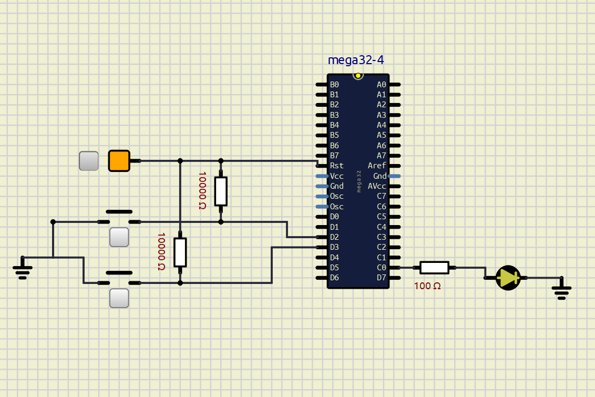

# ATmega32A External Interrupt LED Control

## Overview

This project demonstrates the use of external interrupts INT0 and INT1 on the ATmega32A microcontroller using AVR Assembly Language.

The LED connected to PC0 is controlled entirely through interrupt service routines.

## Features

- AVR Assembly implementation
- External Interrupt INT0
- External Interrupt INT1
- Interrupt-driven LED control
- SimulIDE simulation

## Project Structure

```text
code/
 └── main.asm

simulation/
 └── interrupt_demo.sim1

images/
 └── interrupt.png
```

## Hardware Components

- ATmega32A
- 2 Push Buttons
- LED
- Resistor(s)

## Working Principle

### INT0

When INT0 (PD2) is triggered:

- Interrupt Service Routine executes
- LED connected to PC0 turns ON

### INT1

When INT1 (PD3) is triggered:

- Interrupt Service Routine executes
- LED connected to PC0 turns OFF

## Circuit Diagram



## Building the Project

1. Open the AVR Assembly source file:

   ```text
   code/main.asm
   ```

2. Assemble the program using an AVR assembler such as Microchip Studio (recommended).

3. Load the generated HEX file into the ATmega32A microcontroller in SimulIDE before running the simulation.

## Running the Simulation

### Prerequisites

- SimulIDE installed on your system

### Steps

1. Open SimulIDE.
2. Open:
```text
   simulation/interrupt_demo.sim1
```
3. If the microcontroller does not already contain the program:

   - Double-click the ATmega32A microcontroller in SimulIDE.
   - Locate the **Load firmware** field.
   - Load the generated HEX file into the microcontroller.
     
4. Start the simulation.
5. Press INT0 button to turn LED ON.
6. Press INT1 button to turn LED OFF.

## Source Code

The AVR Assembly source code is available in:

```text
code/main.asm
```

## Author

Ankita Mandal
